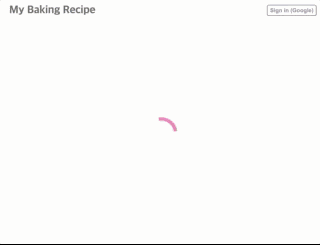
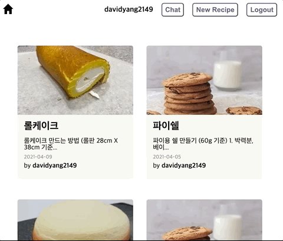
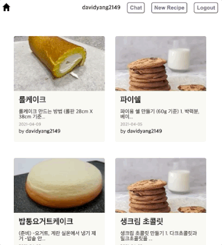

# 🍪 My Baking Recipe Vol.2



🏠 https://mybakingrecipe.app

[My Baking Recipe](https://mybakingrecipe.app)은 레시피를 관리하는 애플리케이션입니다.
## 📚 소개 & 기능

### ⭐ 레시피 페이지



- 레시피 페이지에서는 다양한 레시피를 구경할 수 있습니다.
- 레시피 정보를 보기, 작성, 수정, 삭제(**CRUD**)할 수 있습니다.
- [입력, 수정] 원재료를 Drag and Drop으로 위치를 조정할 수 있습니다.
- [입력, 수정] 이미지 저장(**3MB 이하 / jpg, jpeg, png, gif**)을 지원합니다. 
- 레시피 목록은 무한스크롤(**IntersectionObserver**) 형식으로 구성되어 있습니다.

### ⭐ 채팅 페이지



- **Google 계정**으로 로그인 후 공용 채팅방(Chat)에서 채팅하실 수 있습니다.

### ⭐ 로그인 정책 (2021.04.11 기준)
- 현재는 **Google Auth 로그인**만 지원하고 있습니다.
- 로그인 후 레시피 작성, 수정, 삭제가 가능합니다.
- 로그인 후 공용 채팅방(Chat)에서 채팅하실 수 있습니다.

## 📚 기술 스택 & 라이브러리
- React
- React Router Dom
- Redux, Redux-Thunk, Redux-Toolkit
- Jest, React Testing library
- uuid, react-beautiful-dnd
- Babel, Webpack, ESLint
- Firebase, Storage
- Sentry

## 📚 Install dependencies

```sh
npm install
```

## Run dev server

```sh
npm run dev
```

## Run deploy in github

```sh
npm run deploy
```

## Lint and fix

```sh
npm run lint
```

## Run Coverage

```sh
npm run coverage

# running option
npx jest --watchAll --coverage --detectOpenHandles
```

## Run e2e tests

```sh
# (Require: local server online) npm run dev 
npm run test:e2e
```

PR을 요청 후 close시 CD가 작동하지 않는지 확인합니다.
